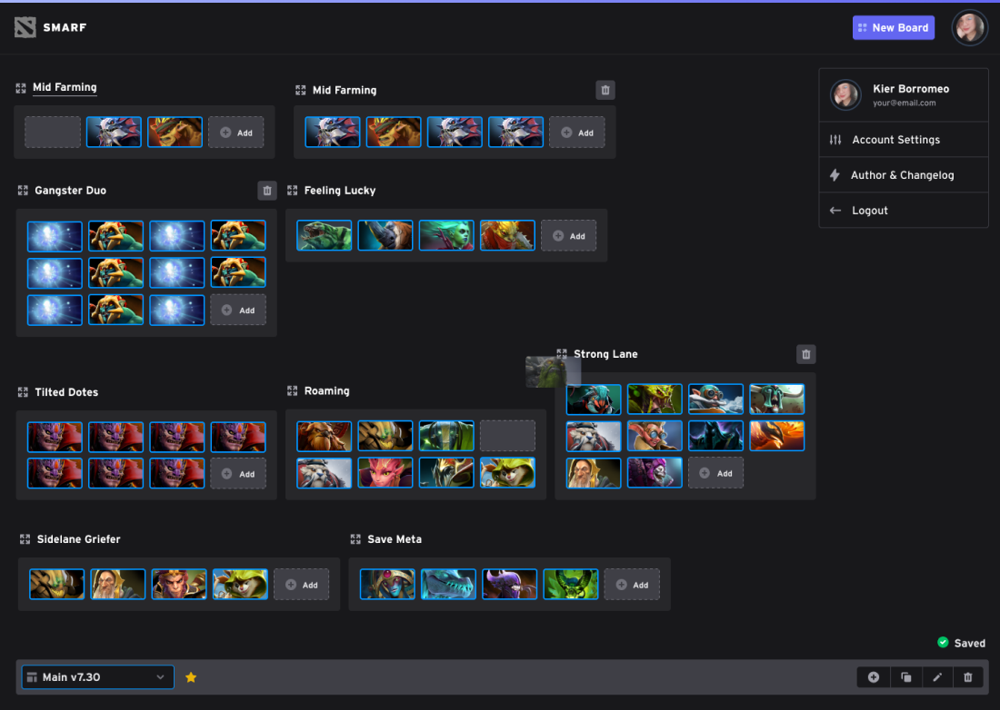

## Smarf (WIP)

Smarf is a dota hero organizer on your browser

### Running API

Go to the `/api` directory. Get Laravel Sails up and running, then run:

```bash
./vendor/bin/sail up
```

### Running UI

Go the `/ui` directory, then run:

```bash
npm install && npm start
```
